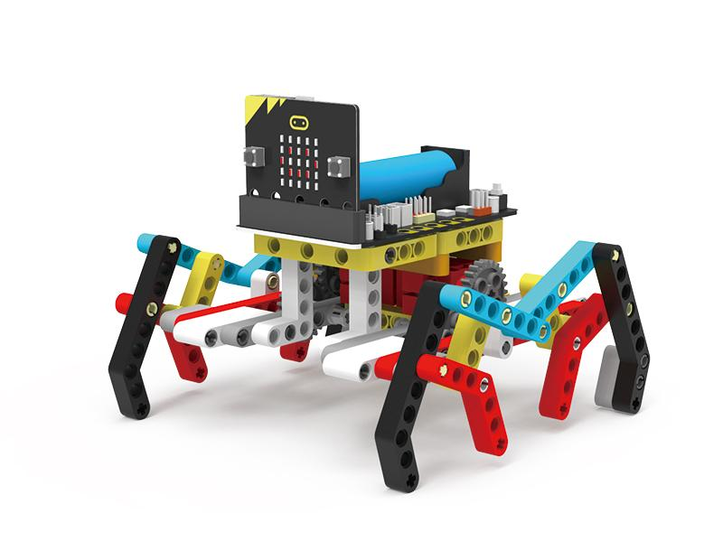
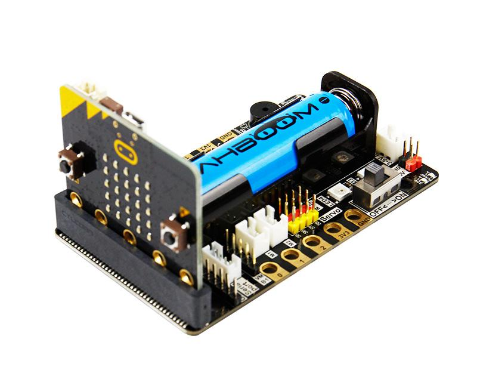

<html>
<body>
<h1>BCC Robotics</h1>
<h2>We will build 3 projects using legos and micro-bit electronics</h2>
<h3>Project 1 Car</h2>
 
 
 

<h2>Project 2 Spider</h2>
This project will be based on the crawling device: 
 
 
<h2>Project 3 Biped</h2>
 
 
<h1>Wiki</h1>
<a href="https://paulware.github.io/BCCRobotics/">Documentation</a>
 
</body>
</html>